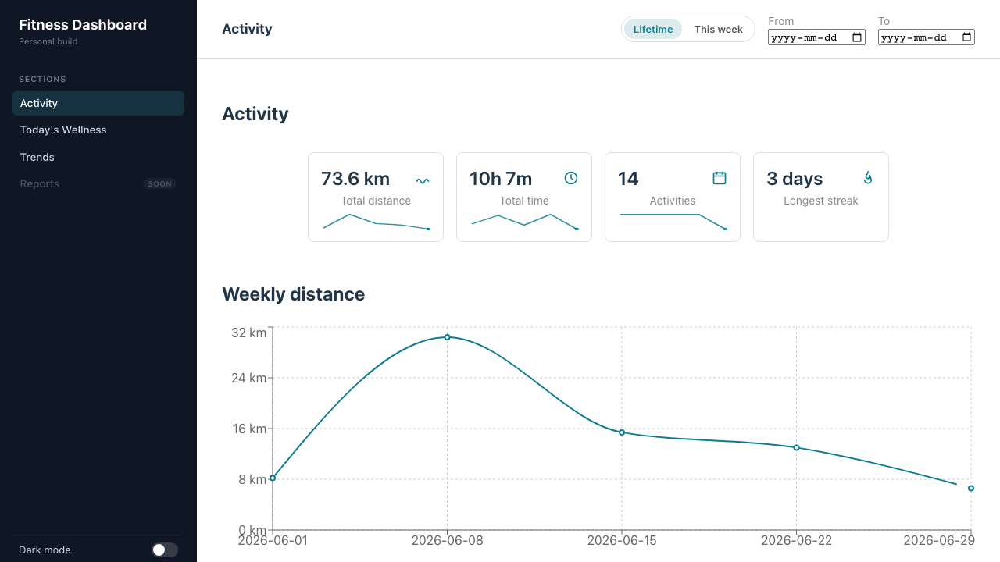
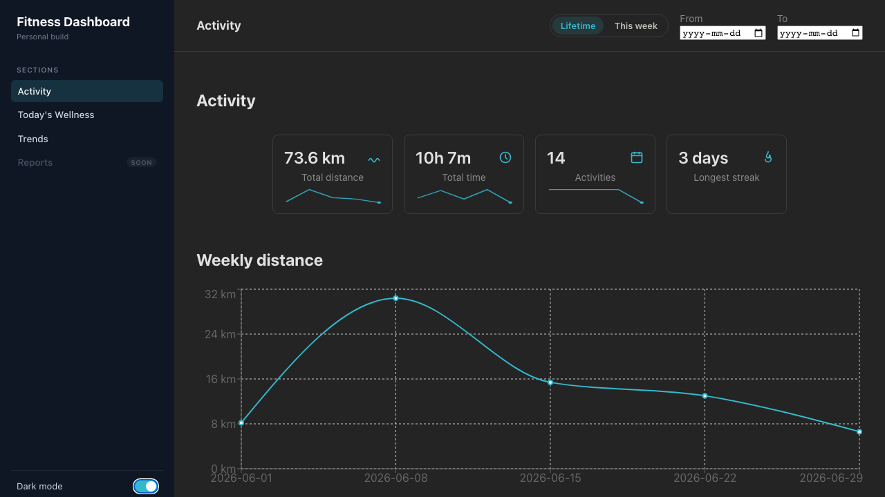

# Fitness Dashboard

[](https://github.com/AJBrewster/fitness-dashboard/actions/workflows/ci.yml)

A dashboard for Garmin activity and wellness data — activity summary stats,
weekly distance trends, activity-type breakdown, date filtering, plus daily
wellness (sleep, heart rate, stress, body battery, training readiness/status)
and longer-range trends (VO2 max, weight) — built as a testing-first
portfolio project.

> 🚧 **In progress.** See [PLAN.md](PLAN.md) for milestones and current status.




## Why fixture data instead of the Garmin API

The app reads from a committed `src/data/activities.json` fixture rather than
calling Garmin's (partner-gated) API. This is a deliberate design choice, not
a shortcut: deterministic data means the test suite can't flake on network
conditions or account state, so CI results are trustworthy. All data access
goes through a single interface (`src/lib/data.js`), so live sync can be
added later as a second implementation without touching the components or
the tests.

The committed fixture is a small set of synthetic activities, not real
Garmin data — kept that way so the repo is safe to publish and runs
identically for anyone who clones it. (A real Garmin data snapshot is kept
locally for development, synced daily in the background via a scheduled
script — see `scripts/launchd/README.md` — but it's gitignored, never
shipped, and only rendered when `VITE_USE_LOCAL_DATA=true` is set
explicitly; see `PLAN.md`'s Data strategy if you're curious about the full
reasoning.) The wellness, VO2 max, and weight data follow the identical
pattern — `src/data/wellness.json`, `vo2MaxTrend.json`, and `weighIns.json`
are the small committed synthetic samples; their real, gitignored
`.local.json` counterparts never ship.

## Testing approach

- **Unit tests (Vitest, 37 tests)** — 35 cover the calculation logic in
  `src/lib/stats.js` (totals, weekly rollups, filters, streak, activity-type
  breakdown, current-week bounds, edge cases), deliberately separated from
  React components so the math is testable without rendering anything; 2
  more use `@testing-library/react` to verify the wellness ring gauge's arc
  math and score-clamping directly.
- **E2E tests (Playwright, 14 tests)** cover the UI, tagged in two layers:
  `@smoke` (7 tests — loads, summary renders, weekly chart, activity-type
  breakdown, wellness summary, trend charts, disabled "Reports" nav
  placeholder) runs on every push; the full set adds 7 more covering the
  date-range filter (basic filter + clear, a no-match range, a
  partial/one-sided range, a single-day range, plus the Lifetime/This week
  presets) and runs on demand. Same smoke/regression layering used in
  production test suites.
- **CI (GitHub Actions)** runs lint, unit tests, the build, and the
  Playwright `@smoke` set on every push (`.github/workflows/ci.yml`),
  uploading the HTML report as an artifact even on failure. The full
  Playwright suite runs on demand only, by design — not part of the push
  gate.

## Running locally

```bash
npm install
npm run dev             # dashboard at localhost:5173
VITE_USE_LOCAL_DATA=true npm run dev  # preview real synced Garmin data instead of the fixture
npm test                # unit tests (Vitest)
npm run test:e2e:smoke  # Playwright @smoke tests (what CI runs)
npm run test:e2e        # full Playwright suite
```

## Stack

React + Vite · Recharts · JavaScript · Vitest · Playwright · GitHub Actions
